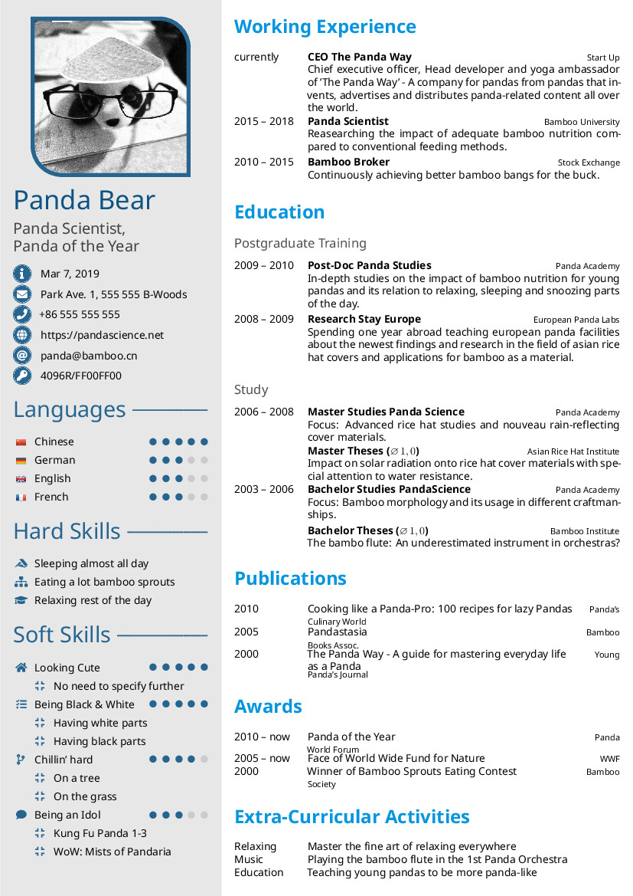
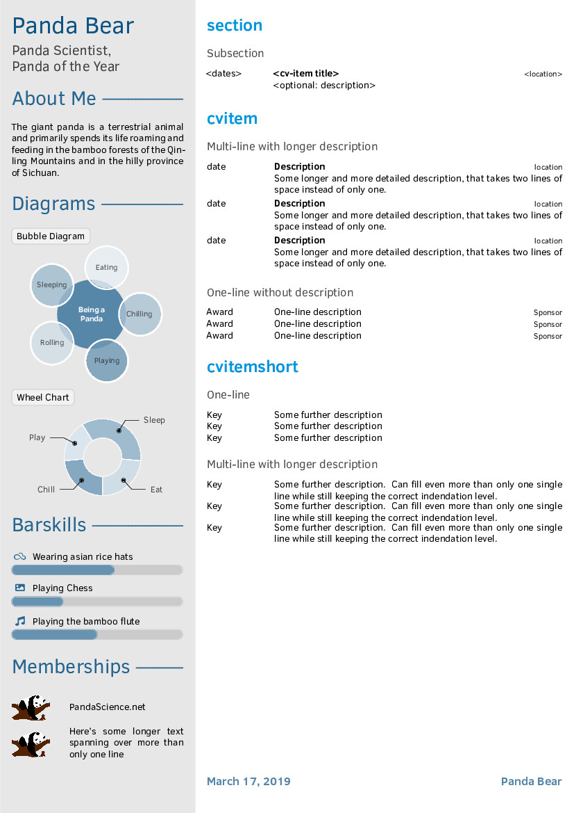

Forty Seconds CV
================

## Description

Just another CV class for LaTeX - but this time highly customizable!

This project can be regarded as a major rewrite of the original twentysecondcv
class. It does not aim to provide a new CV style that you can't find anywhere
else, but rather takes a very well established one and adds a straightforward
user interface to almost all layout elements and thus creates a highly
customizable framework-class: FortySecondsCV.

Just try it yourself starting from `template.tex`!

When you should use twentysecondcv or altacv or any other LaTeX CV class:

* You are happy with the layout elements offered by the existing CV class styles
* You don't need to change paper sizes / formats at all
* You don't want to customize your CV further

When you should use the FortySecondsCV class:

* You like to build a CV optimized for 2 pages incl. a sidebar (with option for
  additional pages)
* You want to highly customize your CV using a great palette of colors and
  layout elements
* You don't want to modify any definition in the class file
* You prefer an easy-to-use user interface to almost all style elements
* You need a cleanly written class file in case you decide to change low-level
  class definitions


## Attributions

* This LaTeX CV class is based on the style ideas of the
  [twentysecondscv class](https://github.com/spagnuolocarmine/TwentySecondsCurriculumVitae-LaTex)
  by Carmine Spagnuolo
* Language icons in the template are taken from [gosquared's repository](https://github.com/gosquared/flags)


## Requirements

You need to compile your document with XeLaTeX or LuaLaTeX in order to have
the latest Font Awesome icons (`fontawesome5`) and Academicons. If you still
want to compile with pdfLaTeX for whatever reason, FortySecondsCV will fall
back to the older icon package (`fontawesome`), where some icons look
different and some others are not even included and Academicons won't be
available at all.

## License

Forty Seconds CV is distributed under the BSD 3-Clause license. See LICENSE
file for more information.

## User Interface

### Class Options

Possible options that can be passed to FortySecondsCV are:

* all valid options for the standard article class like e.g. `a4paper` or
  `11pt`.
* `showframes` will show frames around the sidebar and body texts that help to
  adjust margins correctly. Note, that this will move content of tables
  slightly since tabular lines also take some space.
* `vline=<length>` plots a red vertical line at x-position `<length>` to help
  adjust sidebar content.
* `maincolor=<color>` sets the theme color used for the entire sidebar incl.
  headings, icons and charts. Many colors are derived from it.
* `sidecolor=<color>` sets the background color of the sidebar.
* `sectioncolor=<color>` sets the color of section headings in the body text.
* `itemtextcolor=<color>` sets the color of cvitem descriptions.
* `subsectioncolor=<color>` same as sectioncolor for subsections.
* `sidebarwidth=<length>` sets the total width of the sidebar, i.e. the width
  of the visible sidebar color.
* `topbottommargin=<length>` sets the top and bottom page margin for both
  columns.
* `leftrightmargin=<length>` sets the left and right page margin for both
  columns as well as how much space will be between both columns.
* `profilepicsize=<length>` sets the width of the profile picture.
* `profilepicborderwidth=<length>` sets the width of the profile picture's
  border.
* `profilepicstyle=profilecircle` clips the profile picture to a circle as in
  the original `twentysecondcv` class.
* `profilepiczoom=<float>` sets the zoom factor for the profile picture.
  Together with the two options below, this allows you to use your favorite
  profile picture directly without modification and crop it here.
* `profilepicxshift=<length>` sets the xshift for the profile picture.
* `profilepicyshift=<length>` sets the yshift for the profile picture.
* `profilepicrounding=<length>` sets the rounding radius for the top right and
  bottom left corner in the default rounded profile picture style.

Note:

* Lengths can be specified in any absolute length unit, e.g. `em` for widths,
  `ex` for heights or relative ones like `0.5\paperheight` or `0.3\linewidth`.
* Colors can be picked from the entire catalogue provided by the `dvipsnames`,
  `svgnames` and `x11names` options of the `xcolor` package. See 
  [xcolor package documentation](http://mirrors.ctan.org/macros/latex/contrib/xcolor/xcolor.pdf)
  for details and color tables.
* Colors can also be redefined within the document body using e.g. `\definecolor{sidecolor}{HTML}{000000}`.

### Sidebar

Sidebars on front and back of the CV are generated using the commands
`\makefrontsidebar` and `\makebacksidebar` within the `document` part of the
LaTeX code. It is recommended to use `\newpage` immediately before
`\makebacksidebar`.

Layout elements in front and back sidebar can be added either by using
```latex
\addtofrontsidebar{}
\addtobacksidebar{}
```
where some pre-defined elements like profile picture, name and job title are
already set, or completely redefine them using
```latex
\renewcommand{\makefrontsidebar}{%
  \begin{sidebar}
    <your code>
  \end{sidebar}
}
```
The `sidebar` environment makes sure that at least all text will be positioned
correctly within the left column (sidebar) of each page. If you need something
more restrictive, e.g. to prevent overflow when using multiple chart labels,
you can enclose parts of the sidebar content in a `sidebarminipage`:
```latex
\begin{sidebarminipage}
	\chartlabel{Bubble Diagram}
	\chartlabel{with}
	\chartlabel{proper}
	\chartlabel{overflow}
	\chartlabel{protection}
	\chartlabel{for}
	\chartlabel{labels}
\end{sidebarminipage}
```
Using the `sidebar` environment, you can also add more sidebar definitions for
additional pages easily.

If you want to remove the sidebar entirely on a single page, just don't call
any of the sidebar constructors. Then you may set your preferred margins using
```latex
\newpage
% no \makebacksidebar etc.
\newgeometry{
	top=<length>,
	bottom=<length>,
	left=<length>,
	right=<length>
}
```
The defaults are `\leftrightmargin` and `\topbottommargin`. In case you want
to return to the default layout on subsequent pages, simply call
`\restoregeometry` after the next `\newpage`.

### Personal Information

Set personal information via convenience commands
```latex
  % profile picture
  \cvprofilepic{pics/profile.png}
  % your name
  \cvname{Panda Bear}
  % job title/career
  \cvjobtitle{Panda Scientist,\\[0.2em] Panda of the Year}
  % date of birth
  \cvbirthday{Mar 7, 2019}
  % short address/location, use \newline if more than 1 line is required
  \cvaddress{Park Ave.~1, 555 555 B-Woods}
  % phone number
  \cvphone{+86 555 555 555}
  % personal website
  \cvsite{https://pandascience.net}
  % email address
  \cvmail{panda@bamboo.cn}
  % pgp key
  \cvkey{4096R/FF00FF00}{0xAABBCCDDFF00FF00}
  % any other custom entry
  \cvcustomdata{\faFlag}{Chinese}
```
* Only `\cvname` and `\cvjobtitle` are mandatory.
* If you want any (optional) entry not to show up in your CV, simply don't use
  it. If you don't use any of these convenience commands, the personal
  information table will not appear at all.
* The email address will be automatically linked with `mailto:email`.
* Your website will be hyperlinked as well.
* For the pgp key, the first argument defines the displayed text which is
  linked to a keyserver searching for the ID in the second argument.  
  Note: For safety, you should use your key's long ID or its fingerprint in the
  second argument.
* The `\cvcustom{<icon>}{<text>}` macro shows how to define new lines using an icon as first
  and some text as second argument. Behind the scenes, this command is actually
  used to define the other convenience commands in the above example.

If you don't like the default style of the "personal information table", you
can define your own via
```latex
\begin{icontable}[<arraystretch=1>]{<width 1st column>}{<space between columns>}
  \personal{<icon>}{<text>}
  \social{<icon>}{<url>}{<text>}
\end{icontable}
```
where the width of the 1st column will also determine the size of all icons in
this column, since icons are scaled to maximum width of their cell. For visual
purposes, you can fine-tune the space between icons and corresponding text with
the 2nd mandatory argument. The optional argument determines the spacing
between table lines, which is only important for small icon heights (i.e. small
1st columns).

* `\personal` takes an icon and a text. The icon is passed to
  `\circleicon{<icon>}`, which draws a circle filled with `maincolor` around
  the icon symbol. The symbol itself appears white.
* `\social` takes an icon and url + text. `Text` will be hyperlinked to `url`.
  In case `url` is empty, your LaTeX compiler will throw a harmless warning
  about "Suppressing link with empty target" and text will not be hyperlinked.
  The icon itself is passed to `\socialicon{<icon>}`, which simply resizes
  the icon symbol and draws it in `maincolor`. This version is the preferred
  one for social network icons (see example).

The default "personal information table" uses
```latex
\begin{icontable}[1.6]{1.7em}{0.4em}
  \personal{<icon>}{<text>}
\end{icontable}
```


### Further Sidebar Style Elements

* Section heading
  ```latex
  \profilesection{<section title>}
  ```

* Simple skill containing only an icon and some text and with optional
  indentation
  ```latex
  \skill[<indent>]{<icon>}{<text>}
  ```

* Pointskill consisting of an icon, text, the number of points and optionally
  the maximum possible number (default: 5).
  Some examples:
  ```latex
  \pointskill{<icon>}{<text>}{<points>}
  ```
  creates a skill using a Font Awesome or Academicons icon with some text and a
  ranking of
  `<points>` out of 5 points.
  ```latex
  \pointskill{<icon>}{<text>}{<points>}[<maxnum>]
  ```
  creates a skill using a Font Awesome or Academicons icon with some text and a
  ranking of `<points>` out of `<maxnum>` possible points.
  ```latex
  \pointskill{\flag{DE.png}}{German}{5}
  ```
  creates a language skill using a flag-icon, which has to be indicated using
  the `\flag` command in order to inform the class that the icon should not be
  colored using `\maincolor`.

* Barskill consisting of an icon, text and percentage of how far the skillbar
  should be filled
  ```latex
  \barskill{<icon>}{<text>}{<percentage>}
  ```
* "About me" text
  ```latex
  \aboutme{<text spanning multiple lines>}
  ```

* Rounded and colored label for e.g. charts and other graphics
  ```latex
  \chartlabel{<text>}
  ```

* Wheel chart
  ```latex
  \wheelchart{<outer radius>}{<inner radius>}{%
    <percentage>/<spacing>/<color>/<text>,
    <percentage>/<spacing>/<color>/<text>
  }
  ```
  * Percentages should add up to 100

* Memberships
  ```latex
  \begin{memberships}[<separation>=1em]
    \membership[<iconwidth>=4em]{<logo>}{<text>}
    \membership[<iconwidth>=4em]{<logo>}{<text>}
    \membership[<iconwidth>=4em]{<logo>}{<text>}
  \end{memberships}
  ```
  * Width of the 1st column containing the icons is equal to the width of the
  	largest icon such that all text entries in the 2nd column are aligned.

* Social Networks
  ```latex
  \begin{socialnetwork}[<separation>=1em]
  	\social{<icon>}{<url>}{<text>}
  	\social{<icon>}{<url>}{<text>}
  	\social{<icon>}{<url>}{<text>}
  \end{socialnetwork}
  ```
  * Another icon style that could be used for e.g. social network icons from
  	Academicons, but is working for FontAwesome icons as well.
  * `text` will be hyperlinked to `url`.
  * `text` may be formatted as preferred like usual via e.g. `\texttt{}` etc.

### Body
The right column of the CV containing tables for sth. like "working experience"
has to be defined within the `document` environment.

* Section and subsection headings
  ```latex
  \cvsection
  \cvsubsection
  ```

* CV items should be enclosed by `cvtable`, independent of the item type.
  Possible types are:
  ```latex
  \begin{cvtable}[<arraystretch>=1]
    \cvitem{<dates>}{<title>}{<location>}{<description>}
    \cvitem{<dates>}{<title>}{<location>}{}
    \cvitemshort{<key>}{<description>}
    \cvpubitem{<title>}{<author>}{<journal>}{<year>}
  \end{cvtable}
  ```
  * `cvitem` including a description will make the title bold, left-align the
    date, right-align the location and put the description indented on the next
    line. The description itself will be in `itemtextcolor` defined in the
    [class options](#class-options).
  * `cvitem` missing a description will add a one-line item in the style of the
    former one but with a "normal" title instead of a bold one.
  * `cvitemshort` left-aligns `<key>` followed by its description.
  * `cvpubitem` adds an entry with left-aligned year/date, bold title on same
  	line followed by italic author and normal text journal, each on its own
  	line.
  * `<arraystretch>` modifies the spacing between items of `cvtable`. For
	tables of `cvitem`, you should use at least 1.5, for `cvitemshort` and
	`cvitem` without description, the default value is sufficient.

* Coloring
  `cvsection`, `cvsubsection` and description text colors can be defined as
  described in [class options](#class-options).

* Name and job title combination with proper spacing, font and color
  ```late
  \nameandjob
  ```

* Finalizing the CV with a place, date and signature as common practice in e.g.
  Germany is done via
  ```latex
  \cvsignature
  ```

### Font Configuration

* Change font either by loading the corresponding package, e.g. for google noto
  font
  ```latex
  \RequirePackage[sfdefault]{noto} % use noto google font
  ```
  or by using XeLaTeX's option to load local fonts directly via fontspec
  ```latex
  \RequirePackage[quiet]{fontspec}
  \newfontfamily\headingfont[Path = fonts/]{segoeuib.ttf}
  ```


## Example



